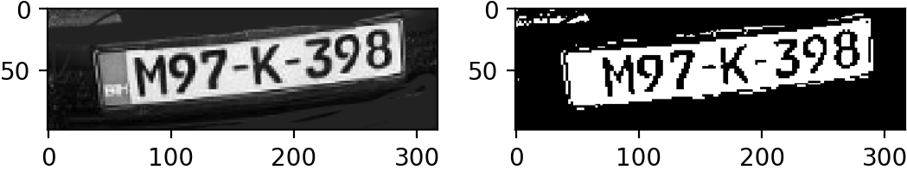

# ParkingToll

## Overview

**ParkingToll** is an intelligent automated license plate recognition (ALPR) system designed to enhance toll gate and parking management efficiency. By leveraging OpenCV and machine learning, this project detects license plates, segments characters, and identifies vehicle registration numbers from images. It integrates with a backend API and database to manage vehicle entries and exits.

## Features

- License plate detection using image processing (OpenCV)
- Character segmentation and recognition using a trained machine learning model
- Integration with a SQL database for logging vehicle activity
- Web-based interface for real-time plate management
- Modular Python code for detection, prediction, and database interaction

## Project Structure

```
ParkingToll-main/
├── DetectPlate.py                  # Detects license plates in images
├── PredictCharacters.py           # Predicts characters from segmented plate
├── SegmentCharacters.py           # Segments individual characters from plates
├── TrainRecognizeCharacters.py    # Script to train character recognition model
├── config.py                      # Configuration constants and parameters
├── create_db                      # Script to create initial database structure
├── db.sql                         # SQL file for database schema
├── dbAPI.py                       # API to interface with the database
├── finalized_model.sav           # Trained machine learning model
├── main.py                        # Main pipeline for plate recognition
├── requirements.txt               # Python dependencies
├── slika1.png / slika3.jpg ...    # Sample input images
├── management/
│   ├── management.html            # Web interface
│   ├── management.php             # PHP backend logic
│   ├── styles.css                 # Styling for web interface
│   └── output/                    # Output images
```

## Requirements

- Python 3.8+
- OpenCV
- scikit-learn
- numpy
- Flask (optional for deployment)
- MySQL or compatible SQL database

Install dependencies:

```bash
pip install -r requirements.txt
```

## Usage

1. **Training the Model**
   ```bash
   python TrainRecognizeCharacters.py
   ```

2. **Running the Recognition**
   ```bash
   python main.py
   ```

3. **Database Setup**
   - Run `db.sql` on your SQL server to initialize the schema.
   - Use `create_db` or `dbAPI.py` for interactions.

4. **Web Interface**
   - Open `management/management.html` in browser
   - Ensure backend PHP and SQL server are configured for data sync

## Demo

Sample detection output can be found in the `management/output/` folder:


## License

This project is for educational and demonstration purposes.

---

Designed to showcase skills in computer vision, machine learning, and backend integration.
